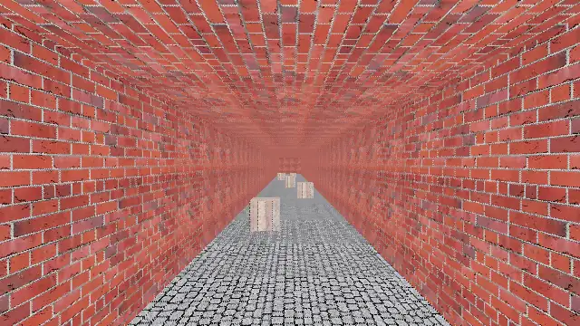

# Screengine

English: [README.md](README.md)

Un moteur de rendu 3D logiciel, appelable depuis n'importe quel langage. Pas de
GPU, pas de fenêtre : on lui donne une scène et un tampon, il remplit le tampon.



*L'exemple `couloir` de `screengine-play`, rendu en 640×360 : textures,
mipmaps, filtrage bilinéaire. Le filtrage par défaut, lui, est le tramage
ordonné des coordonnées, et l'exemple bascule de l'un à l'autre — c'est en
marchant que les deux se départagent.*

MIT ou Apache-2.0, au choix — voir [`LICENSE-MIT`](LICENSE-MIT) et
[`LICENSE-APACHE`](LICENSE-APACHE). Sauf mention contraire de son auteur, toute
contribution proposée à l'inclusion est placée sous ces deux mêmes licences, sans
condition supplémentaire. Les textures versionnées sont produites pour le projet
et suivent les mêmes licences : rien ici ne vient d'un jeu existant.

La cible est la classe des moteurs logiciels de 1996 à 1998, faite proprement :
couleurs directes, perspective corrigée, mipmaps, lightmaps, brouillard, filtrage
par tramage ordonné des coordonnées par défaut et bilinéaire en niveau de
qualité, résolution interne basse remontée en entier.
Cette classe tournait en logiciel sur un PC de 1998 ; un cœur de téléphone
actuel est bien plus rapide, et la marge va à la batterie et à la chauffe.

Tout ce qui suit la projection est en virgule fixe, et le rendu se fait par
tuiles : la même scène donne la même image au bit près sur toutes les cibles,
tous les chemins SIMD, toutes les tailles de tuile et tous les nombres de
threads.

## Ce qu'il ne fait pas

C'est ce qui le rend intégrable, donc ça vient avant le reste. Le moteur n'ouvre
aucune fenêtre, ne lit aucun clavier, n'ouvre aucun fichier, ne joue aucun son et
ne connaît aucune notion de jeu — ni joueur, ni arme, ni score.

L'hôte fournit la fenêtre, les entrées et les octets. Le moteur transforme et
rend. Cette frontière est la seule raison pour laquelle le même code sert sous
Windows, dans un navigateur et sur un téléphone. `screengine-play` est l'un de
ces hôtes, écrit en Rust pour qui fait un jeu, et le moteur ignore son existence.

## État

**Étape 1 franchie, publiée en 0.1.0 : le pipeline, sans textures ni
lumière.** Vecteurs, quaternions et trigonométrie par tables, projection,
découpage en espace homogène, tampon de profondeur, rasteriseur à fonctions de
bord et rendu par tuiles. L'hôte décrit sa scène — une caméra, des sommets, des
triangles colorés — et les quatre hôtes de référence rendent la même image au
bit près. Les surfaces sont des aplats : les textures sont l'étape 2, la
lumière l'étape 3.

La feuille de route compte dix étapes, publiées à chacune.

- [`ROADMAP.md`](ROADMAP.md) — les étapes, celles qui sont franchies et ce qui
  est hors périmètre v1
- [`CHANGELOG.md`](CHANGELOG.md) — ce que chaque version a apporté, daté
- [`docs/abi.md`](docs/abi.md) — le contrat de la frontière C, qui fait foi
- [`docs/construction.md`](docs/construction.md) — cibles, matrice de
  compilation, génération du header

## Utilisation

Deux chemins, selon ce qu'on écrit.

### Faire un jeu, en Rust

`screengine-play` fournit la fenêtre, le clavier, la souris et une boucle à pas
fixe, et remonte l'image par facteur entier. Sans aucun réglage, il ouvre une
fenêtre qui marche :

```rust
use screengine_play::{Affine3, Color, KeyCode, Play, Triangle, Vec3};

const VERTICES: [Vec3; 3] = [
    Vec3::new(4.0, 1.5, -1.0),
    Vec3::new(4.0, 0.0, 1.5),
    Vec3::new(4.0, -1.5, -1.0),
];

const TRIANGLES: [Triangle; 1] = [Triangle {
    indices: [0, 1, 2],
    color: Color::new(0xE0, 0xA0, 0x30, 0xFF),
}];

fn main() -> Result<(), screengine_play::Error> {
    Play::new().run(
        (),
        |_, tick| {
            if tick.input().pressed(KeyCode::Escape) {
                tick.exit();
            }
        },
        |_, context| {
            let _ = context.submit(Affine3::IDENTITY, &VERTICES, &TRIANGLES);
        },
    )
}
```

`make run` lance cet exemple. `make example EXAMPLE=couloir` en lance un autre :
un couloir qu'on parcourt aux flèches et à la souris, avec des caisses posées au
sol. Le chemin Rust ajoute du confort, jamais de capacité : tout ce qu'il permet
se fait aussi par l'ABI C.

### Intégrer, depuis n'importe quel langage

L'hôte garde sa fenêtre, sa boucle et ses entrées. La bibliothèque expose une
ABI C stable, préfixée `scg_`, dont le header est généré :

```c
ScgContextConfig config = {0};
config.max_width = config.width  = 640;
config.max_height = config.height = 360;
config.tile_size = 64;

ScgContext *ctx;
if (scg_create(&config, &ctx) != SCG_OK) {
    fprintf(stderr, "%s\n", scg_last_error(NULL));
    return 1;
}

ScgMat4 model = {{1, 0, 0, 0, 0, 1, 0, 0, 0, 0, 1, 0, 0, 0, 0, 1}};
ScgVertex vertices[3] = {{4, 1.5f, -1}, {4, 0, 1.5f}, {4, -1.5f, -1}};
ScgTriangle triangle = {0, 1, 2, 0xE0, 0xA0, 0x30, 0xFF};
scg_submit(ctx, &model, vertices, 3, &triangle, 1);

scg_frame_end(ctx, pixels, stride);
scg_destroy(ctx);
```

Des handles opaques, aucun callback, aucune allocation qui traverse la
frontière. Toute fonction faillible rend un code, et ce qu'elle produit passe
par un paramètre de sortie. Les liaisons vivent dans des dépôts séparés et ne
contiennent que de la conversion de types.

Sur le web, l'hôte ne peut pas fournir un pointeur arbitraire : il alloue son
tampon par `scg_buffer_alloc` et construit une vue dessus. C'est la seule
différence entre les plateformes.

## Construction

```
make build     # noyau et bibliothèque partagée
make run       # ouvre une fenêtre sur le moteur
make header    # régénère include/screengine.h
make test      # dont les hôtes C, C++, wasm et Android, si leur outillage est là
make conform   # rejoue les scènes de référence et compare les empreintes
make lint
make nostd     # preuve que le noyau compile sans std
make web       # sert la page de l'hôte wasm sur http://127.0.0.1:8080/
```

Le noyau est `no_std` et n'a aucune dépendance. Un dépôt fraîchement cloné
compile sans rien installer d'autre qu'une chaîne Rust ; seul `screengine-play`
porte des dépendances : `winit`, `softbuffer` et `png`.

L'hôte wasm demande Node et la cible `wasm32-unknown-unknown`, que
`make tools` installe ; l'hôte Android demande NDK, SDK, émulateur et
`qemu-user`, que `hosts/android/Dockerfile` réunit sous Linux avec KVM. iOS attend que le reste soit stable — voir la feuille de
route. [`docs/construction.md`](docs/construction.md) porte la
matrice complète.
