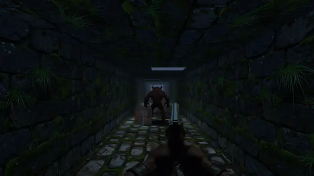

# Screengine

Français : [README.fr.md](README.fr.md)

A software 3D rendering engine, callable from any language. No GPU, no window:
you hand it a scene and a buffer, it fills the buffer.



*The `couloir` example from `screengine-play`, rendered at 640×360: textures,
mipmaps, bilinear filtering, lightmaps, dynamic lights, fog, an output curve,
and quads the engine orients on the camera. Daylight comes from the lightmaps
the example bakes, the tubes are dynamic lights and flicker. The weapon and the
creature are sprites with binary transparency: the creature picks its view from
eight according to the angle it is seen from, and the patch trailing it on the
floor is a modulated surface, darkening the flagstones instead of covering
them. The default filter is ordered dithering of texture coordinates, and the
example toggles between the two — they are told apart while walking.*

MIT or Apache-2.0, at your option — see [`LICENSE-MIT`](LICENSE-MIT) and
[`LICENSE-APACHE`](LICENSE-APACHE). Unless you state otherwise, any contribution
you submit for inclusion is dual licensed the same way, without additional terms
or conditions. The textures in this repository were produced for the project and
carry the same licences: nothing here comes from an existing game.

The target is the class of 1996–1998 software renderers, done properly: true
colour, perspective-correct texturing, mipmaps, lightmaps, fog, ordered-dither
texture filtering by default with bilinear as a quality level, low internal
resolution scaled up by an integer factor. That class ran in software on a 1998
PC; a current phone core is many times faster, and the headroom goes to battery
and heat.

Everything after projection is fixed-point, and rendering is tile-based: the
same scene gives the same image to the bit on every target, every SIMD path,
every tile size and every thread count.

## What it does not do

That comes first, because it is what makes the engine embeddable. The engine
opens no window, reads no keyboard, opens no file, plays no sound, and knows
nothing about games — no player, no weapon, no score.

The host provides the window, the input and the bytes. The engine transforms and
renders. That boundary is the only reason the same code runs on Windows, in a
browser and on a phone.

## Status

**Step 9 cleared, released as 0.9.0: SIMD.** Four vector paths fill a flat
surface — SSE2 and AVX2 on x86, NEON on `aarch64`, `simd128` on wasm — selected
at runtime and forceable through the ABI. None moves a pixel: each has its own
conformance pass, and the core now runs on four architectures instead of one.
Filling a textured surface is still scalar, on a gain measured at one and a half
percent.

The wasm module requires `simd128`: it no longer instantiates on a browser
without that feature.

The roadmap has ten steps, each one published.

- [`ROADMAP.md`](ROADMAP.md) — the steps, which are cleared, and what is out of
  scope for v1 (French)
- [`CHANGELOG.md`](CHANGELOG.md) — what each version brought, dated
- [`docs/abi.md`](docs/abi.md) — the C boundary contract, which is authoritative
  (French; the generated header carries the essentials in English)
- [`docs/construction.md`](docs/construction.md) — targets, build matrix, header
  generation (French)
- [`docs/cartes.md`](docs/cartes.md) — how to author a level: cells, portals,
  lightmap frames (French)

## Usage

Two paths, depending on what you are writing.

### Making a game, in Rust

`screengine-play` provides the window, keyboard, mouse and a fixed-step loop,
and scales the image up by an integer factor. It also hands back the finished
image before it goes to the window — that is where an interface is drawn, and
nowhere else. With no settings at all, it opens a working window:

```rust
use screengine_play::{Affine3, Color, KeyCode, Play, Triangle, Vec3};

const VERTICES: [Vec3; 3] = [
    Vec3::new(4.0, 1.5, -1.0),
    Vec3::new(4.0, -1.5, -1.0),
    Vec3::new(4.0, 0.0, 1.5),
];

const TRIANGLES: [Triangle; 1] = [Triangle {
    indices: [0, 1, 2],
    color: Color::new(0xE0, 0xA0, 0x30, 0xFF),
}];

fn main() -> Result<(), screengine_play::Error> {
    Play::new().run(
        (),
        |_, tick| {
            if tick.input().pressed(KeyCode::Escape) {
                tick.exit();
            }
        },
        |_, context| {
            let _ = context.submit(Affine3::IDENTITY, &VERTICES, &TRIANGLES);
        },
    )
}
```

`make run` launches this example. Two others run with `make example
EXAMPLE=<name>`: `couloir`, a ruined corridor whose geometry is written in Rust,
and `carte`, the same map all five hosts load. **They are to be watched, not
tested** — they open a window, so no check runs them.

The Rust path adds convenience, never capability: everything it allows can also
be done through the C ABI.

**An integration example**, outside this repository:
[screengine-dedale](https://github.com/sprimault/screengine-dedale), a maze game
consuming this library as any other user would. The examples above show one
feature at a time; it shows the constraints that only appear once they are put
together.

### Embedding, from any language

The host keeps its window, loop and input. The library exposes a stable C ABI
prefixed `scg_`, whose header is generated:

```c
ScgContextConfig config = {0};
config.max_width = config.width  = 640;
config.max_height = config.height = 360;
config.tile_size = 64;

ScgContext *ctx;
if (scg_create(&config, &ctx) < 0) {
    fprintf(stderr, "%s\n", scg_last_error(NULL));
    return 1;
}

ScgMat4 model = {{1, 0, 0, 0, 0, 1, 0, 0, 0, 0, 1, 0, 0, 0, 0, 1}};
ScgVertex vertices[3] = {{4, 1.5f, -1}, {4, -1.5f, -1}, {4, 0, 1.5f}};
ScgTriangle triangle = {0, 1, 2, 0xE0, 0xA0, 0x30, 0xFF};
scg_submit(ctx, &model, vertices, 3, &triangle, 1);

scg_frame_end(ctx, pixels, stride);
scg_destroy(ctx);
```

Opaque handles, no callbacks, no allocation crossing the boundary. Every
fallible function returns a code, and whatever it produces goes through an out
parameter. Bindings live in separate repositories and hold nothing but type
conversion.

On the web the host cannot pass an arbitrary pointer: it allocates its buffer
through `scg_buffer_alloc` and builds a view over it. That is the only
difference between platforms.

## Building

```
make build     # core and shared library
make run       # opens a window on the engine
make header    # regenerates include/screengine.h
make test      # including all five hosts — C, C++, wasm, Android, Go — if their
               # tooling is present
make conform   # replays the reference scenes and compares hashes
make lint
make nostd     # proof that the core builds without std
make web       # serves the wasm host page on http://127.0.0.1:8080/
make demo-c    # walks through a decor in a window, from the C host
make demo-cpp  # the same, from the C++ host
```

The core is `no_std` and has no dependencies. A fresh clone builds with nothing
installed beyond a Rust toolchain; only `screengine-play` carries dependencies,
`winit`, `softbuffer` and `png`.

The wasm host needs Node and the `wasm32-unknown-unknown` target, which
`make tools` installs; the Android host needs the NDK, SDK, emulator and
`qemu-user`, which `hosts/android/Dockerfile` brings together on Linux with KVM;
the two desktop demonstrations need SDL3, and say what is missing rather than
failing to compile. iOS
waits until the rest is stable — see the roadmap.
[`docs/construction.md`](docs/construction.md) carries the full matrix (in
French).
